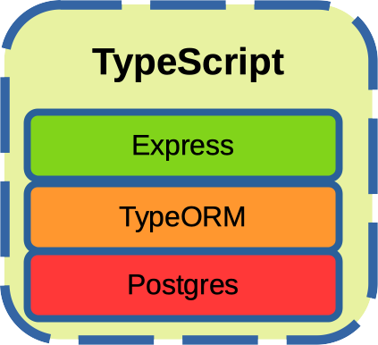

#### Telemetry Collector Server (TypeScript) (WIP)

It is one of the three applications on which will be carried out performance tests in order to determine which are the most performing technologies. This is the TypeScript version. 

     

See also:

- [oh_telemetry_collector_load_test](https://github.com/goto-eof/oh_telemetry_collector_load_test)
- [oh_telemetry_collector_server_java](https://github.com/goto-eof/oh_telemetry_collector_server_java)
- [oh_telemetry_collector_server_rust](https://github.com/goto-eof/oh_telemetry_collector_server_rust)